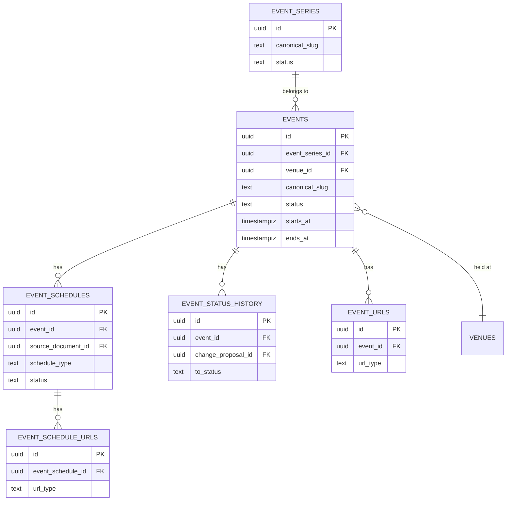
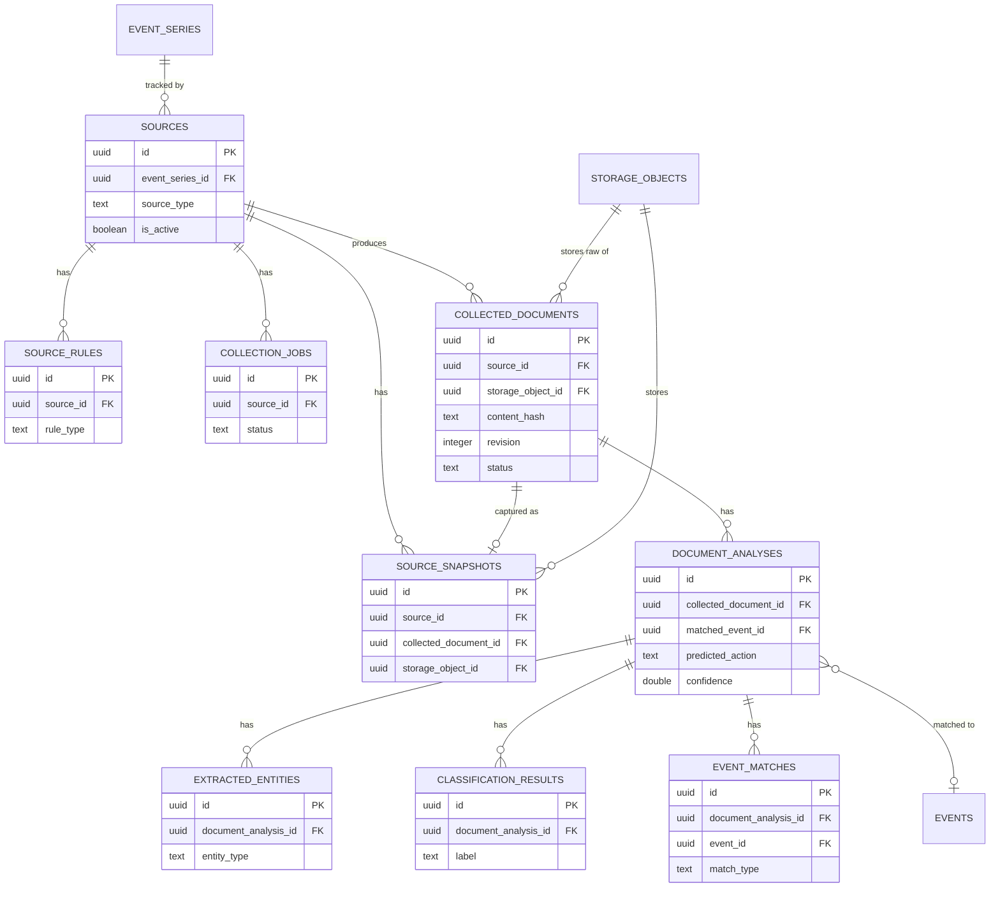
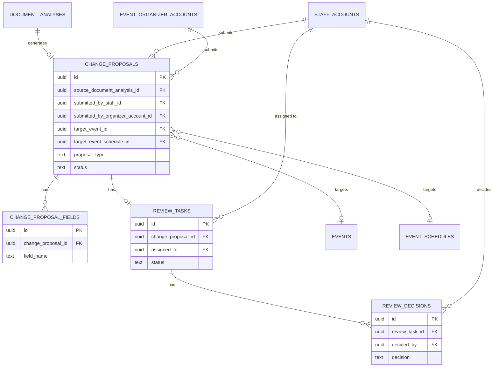
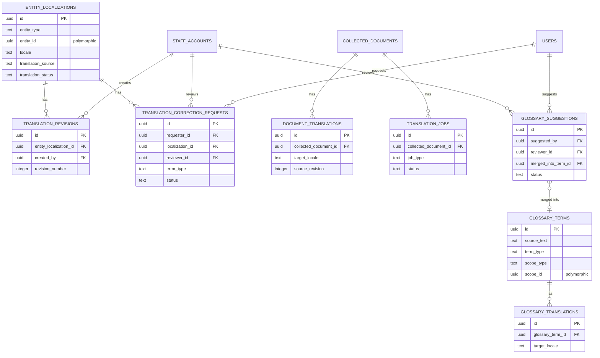
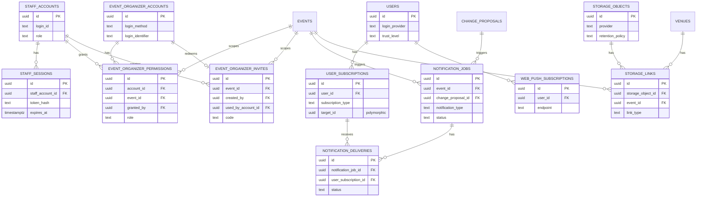

[← 목차](../README.md) · [04. 데이터베이스 설계](../04-database-design.md)

# SCLS ERD

[04-database-design.md §4.5](../04-database-design.md#45-erd)에서 미결로 남아 있던 ERD를 확정한 문서다. 테이블 그룹 구성은 [§4.2](../04-database-design.md#42-주요-테이블-그룹)를 그대로 따르며, 컬럼 단위 정의와 제약조건의 원본은 [schema.sql](schema.sql)이다 — 이 문서의 다이어그램은 관계 파악용으로 PK/FK와 핵심 컬럼만 표시한다.

전체 테이블을 하나의 다이어그램에 넣으면 가독성이 떨어지므로, §4.2의 9개 그룹을 6개 다이어그램으로 묶어 정리한다(태그·인증 등 소규모 그룹은 인접 그룹과 합침).

## 1. 행사 및 일정

## 2. 조직·장소·작품·인물 및 태그

```mermaid
erDiagram
    EVENTS ||--o{ EVENT_ORGANIZERS : has
    ORGANIZERS ||--o{ EVENT_ORGANIZERS : has
    EVENTS ||--o{ EVENT_FRANCHISES : has
    FRANCHISES ||--o{ EVENT_FRANCHISES : has
    EVENTS ||--o{ EVENT_PARTICIPANTS : has
    PARTICIPANTS ||--o{ EVENT_PARTICIPANTS : has

    TAG_GROUPS ||--o{ TAGS : has
    TAGS ||--o{ TAGS : "parent of"
    EVENTS ||--o{ EVENT_TAGS : has
    TAGS ||--o{ EVENT_TAGS : has
    EVENT_SCHEDULES ||--o{ EVENT_SCHEDULE_TAGS : has
    TAGS ||--o{ EVENT_SCHEDULE_TAGS : has
    EVENT_SERIES ||--o{ EVENT_SERIES_TAGS : has
    TAGS ||--o{ EVENT_SERIES_TAGS : has
    FRANCHISES ||--o{ FRANCHISE_TAGS : has
    TAGS ||--o{ FRANCHISE_TAGS : has
    PARTICIPANTS ||--o{ PARTICIPANT_TAGS : has
    TAGS ||--o{ PARTICIPANT_TAGS : has
    VENUES ||--o{ VENUE_TAGS : has
    TAGS ||--o{ VENUE_TAGS : has

    ORGANIZERS {
        uuid id PK
        text canonical_name
        text organizer_type
    }
    VENUES {
        uuid id PK
        text canonical_name
        char country_code
    }
    FRANCHISES {
        uuid id PK
        text canonical_name
        text franchise_type
    }
    PARTICIPANTS {
        uuid id PK
        text canonical_name
        text participant_type
    }
    EVENT_ORGANIZERS {
        uuid id PK
        uuid event_id FK
        uuid organizer_id FK
        text role
    }
    EVENT_FRANCHISES {
        uuid id PK
        uuid event_id FK
        uuid franchise_id FK
    }
    EVENT_PARTICIPANTS {
        uuid id PK
        uuid event_id FK
        uuid participant_id FK
        text role
    }
    TAG_GROUPS {
        uuid id PK
        text canonical_name
    }
    TAGS {
        uuid id PK
        uuid group_id FK
        uuid parent_tag_id FK
        text slug
    }
    EVENT_TAGS { uuid event_id FK
                 uuid tag_id FK }
    EVENT_SCHEDULE_TAGS { uuid event_schedule_id FK
                          uuid tag_id FK }
    EVENT_SERIES_TAGS { uuid event_series_id FK
                        uuid tag_id FK }
    FRANCHISE_TAGS { uuid franchise_id FK
                     uuid tag_id FK }
    PARTICIPANT_TAGS { uuid participant_id FK
                       uuid tag_id FK }
    VENUE_TAGS { uuid venue_id FK
                uuid tag_id FK }
```

## 3. 수집 및 분석

## 4. 검수 및 변경

## 5. 다국어 및 번역

## 6. 인증·사용자·알림·스토리지

## 확정하며 정리한 사항

기존 §4.2/§4.4에 "또는"으로 열려 있던 항목을 다이어그램화 과정에서 다음과 같이 확정했다.

- **태그 표시명**: 전용 `tag_localizations`를 새로 만들지 않고 `entity_localizations`(entity_type='TAG')로 통일한다.
- **change_proposals 제출 주체**: `staff_accounts`와 `event_organizer_accounts`를 가리키는 두 개의 nullable FK(`submitted_by_staff_id`, `submitted_by_organizer_account_id`)로 표현한다. 신뢰 수준이 다른 두 계정 체계를 하나의 다형 FK로 묶지 않기 위함이며, 둘 다 NULL이면 시스템(자동 파이프라인) 제출로 간주한다.
- **다형 참조 허용 범위**: `entity_id`/`target_id`/`scope_id` 형태의 다형 컬럼은 `entity_localizations`, `user_subscriptions`, `glossary_terms`/`glossary_suggestions` 세 곳에만 남기고, 나머지 핵심 관계(행사·태그·조직·스토리지 등)는 전부 대상별 전용 FK로 분리했다 — §4.2 원칙("target_type+target_id 범용 연결 테이블은 사용하지 않는다")과의 정합성을 유지하기 위함이다.
- **event/event_schedule status 값**: 문서에 명시되지 않았던 `events.status`(DRAFT/CONFIRMED/CANCELLED/POSTPONED/ENDED/ARCHIVED), `event_schedules.status`(SCHEDULED/CONFIRMED/CANCELLED/POSTPONED/COMPLETED) 등 세부 상태값을 이번에 확정했다. 구현 중 부족하면 CHECK 제약을 조정한다.
- **staff_sessions 추가**: 최초 ERD 확정 시에는 없던 테이블이다. Phase 1 구현 중 루트 관리자 로그인을 세션+쿠키 방식으로 확정하면서([07-admin-dashboard.md §7.6.3](../07-admin-dashboard.md#763-권한-부여-절차-초안)) 추가했다.

## 다음 단계

- 실제 Migration 도구(Prisma/Drizzle) 선정 후 [schema.sql](schema.sql)을 해당 도구의 스키마 정의로 옮긴다.
- [11-roadmap-and-success.md](../11-roadmap-and-success.md) Phase 1 착수 시 이 스키마를 기준으로 초기 Migration을 생성한다.
